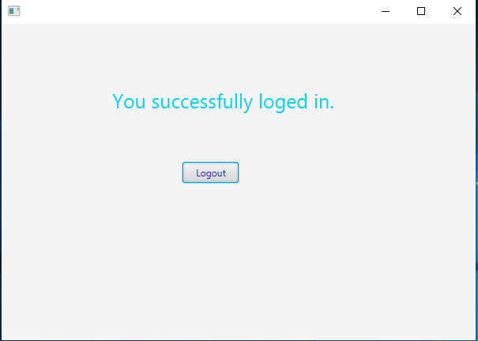
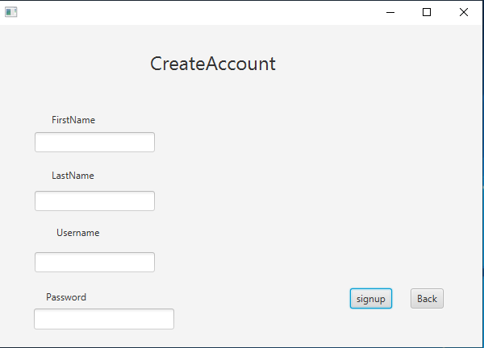

# JavaFX Based Login System

---

## 👉 Requirements

- JDK - 17.0.2
- JavaFX SDK - 17.0.2
- mysql connector jar file
- scene Builder

## vmArgs Setup

```
 "vmArgs": "--module-path C:/javafx/javafx-sdk-17.0.2/lib --add-modules javafx.controls,javafx.fxml"

```

👉 Sample screenshots taken

<br>

<br>

<br>
